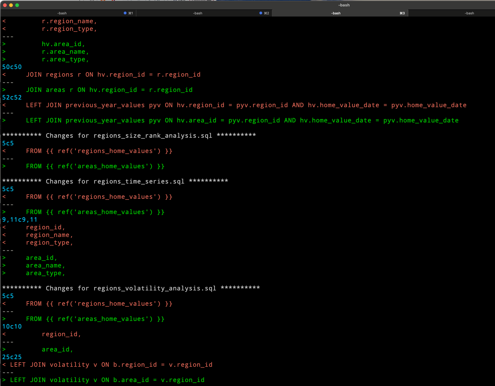

# find-replace

`find-replace` is a shell script for performing global find and replace operations using `sed`. It provides a user-friendly wrapper around `sed`, making it easier to manage and apply complex text transformations across multiple files.

## Origins

This script is based on an example from the book "Unix Power Tools", but has been modified and enhanced for improved functionality and ease of use.

## Features

- Use a separate file to store sed commands for reusability
- Check changes before applying them
- Edit the source file containing sed commands
- Apply changes to multiple files at once
- Diff output for easy review

## Usage

```
find-replace.sh options (-cers) file-to-edit [files-to-edit]
```

### Options

- `-c`: Check the results of the operation (uses `bat` for colorized diff output)
- `-e`: Edit the source file containing sed commands
- `-h`: Print the help message
- `-r`: Run the operation
- `-s` (file): Use a specific source file for sed commands

### Default Source File

By default, the script looks for sed commands in `~/.find-replace.sed`. You can change this by modifying the `DEFAULT_SRC` variable in the script.

## Examples

1. Set up your commands:
   ```
   find-replace.sh -e
   ```

2. See diffs of changes:
   ```
   find-replace.sh -c my_script.py your_script.py
   ```

   Here's an example of what the diff output looks like:

   

3. Run the script on multiple files:
   ```
   find-replace.sh -r *.py
   ```

4. Use with `find` to process files recursively:
   ```
   find . -name "*.py" | xargs find-replace.sh -c
   ```

## Requirements

- Bash
- sed
- bat (for colorized diff output)

## Installation

1. Clone this repository or download the `find-replace.sh` script.
2. Make the script executable:
   ```
   chmod +x find-replace.sh
   ```
3. Optionally, move the script to a directory in your PATH for easy access.

## Contributing

Contributions are welcome! Please feel free to submit a Pull Request.

## License

This script is open-source software. Please include appropriate attribution if you use or modify this script.
